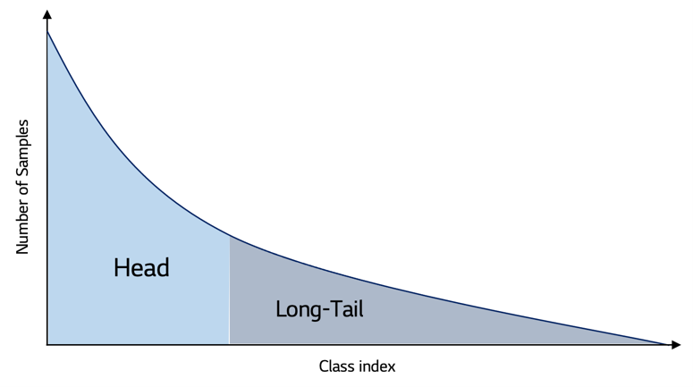
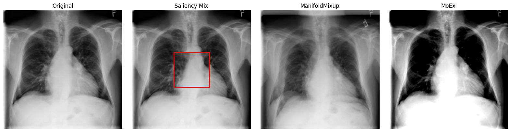
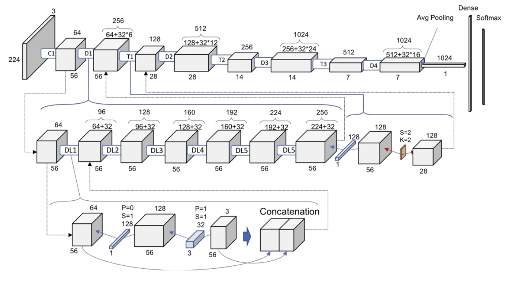

# Long-Tailed Medical Image Classification

This repository provides a PyTorch-based framework for multi-label classification of medical images, focusing on long-tailed distributions and robust handling of class imbalance. The main application is the NIH ChestX-ray14 dataset, but the code is adaptable to other medical imaging tasks.

<p align="center">
   
</p>

## Features
- DenseNet121 and ResNet architectures
- Custom loss functions for imbalance: Focal, LDAM, Balanced Softmax, Equalization, Weighted BCE, ASL
- Advanced augmentations: SaliencyMix, ManifoldMixup, MoEx
- Automated experiment scripts (SLURM)
- Per-class and macro F1, AUROC, AP metrics
- Data exploration notebook

## Augmentations
To improve robustness on long-tailed medical image data, we apply three mixing-based augmentations at different levels of the feature hierarchy: Saliency Mix (local, saliency-guided patch replacement), ManifoldMixup (feature-level interpolation), and MoEx (moment exchange across channels). These are used mutually-exclusively during training and complement imbalance-aware losses to enhance generalization. The figure below provides a visual comparison on the same sample.

<div align="center">
   
</div>

## Model Architecture
We primarily use **DenseNet121** for multi-label classification. DenseNet connects each layer to every other layer in a feed-forward fashion, promoting feature reuse and efficient gradient flow through dense blocks and transition layers. This compact architecture achieves strong performance with relatively few parameters.

We initialize DenseNet with **ImageNet-pretrained weights**, then fine-tune on NIH ChestX-ray14. Pretraining accelerates convergence and improves generalization, especially under long-tailed class distributions.

<p align="center">
   
</p>

## Directory Structure
- `src/` — Core code: dataloading, training, loss functions, augmentations
- `models/` — Model definitions (DenseNet, ResNet)
- `experiments/` — Experiment outputs, metrics, logs
- `notebooks/` — Data exploration and visualization
- `logs/` — SLURM job logs

## Installation
1. Clone the repository:
   ```bash
   git clone https://github.com/ajay-vikram/Long-Tailed-Medical-Image-Classification.git
   cd Long-Tailed-Medical-Image-Classification
   ```
2. Create a conda environment (recommended):
   ```bash
   conda env create -p {env_path} -f venv.yml
   conda activate {env_path}
   ```

## Usage
### Training
Run training with customizable arguments:
```bash
python main.py --train --model DenseNet121 --loss focal --train_epochs 20 --train_lr 1e-4 --train_dir experiments/densenet121_focal --num_classes 14
```
**Important arguments:**
- `--train` : Enable training mode.
- `--model` : Model architecture (`DenseNet121`, `ResNet50`, etc.).
- `--loss` : Loss function (`focal`, `ldam`, `balanced_softmax`, `equalization`, `weighted_bce`, `asl`).
- `--train_epochs` : Number of training epochs.
- `--train_lr` : Learning rate.
- `--train_dir` : Output directory for experiment logs and checkpoints.
- `--num_classes` : Number of output classes (default: 14 for NIH ChestX-ray14).
- `--use_salmix` : Enable SaliencyMix augmentation.
- `--use_manifoldmixup` : Enable ManifoldMixup augmentation.
- `--use_moex` : Enable MoEx augmentation.
- `--salmix_prob`, `--manifoldmixup_prob`, `--moex_prob` : Probability of applying each augmentation.
- `--ldam_max_m`, `--ldam_s` : LDAM loss hyperparameters.
- `--eq_gamma`, `--eq_lam` : Equalization loss hyperparameters.
- `--focal_alpha`, `--focal_gamma` : Focal loss hyperparameters.

See `job.sh` for SLURM job examples and more advanced configurations.

### Data Exploration
Use `notebooks/data_exploration.ipynb` to visualize label distribution and dataset statistics.

### Experiment Results
Metrics and logs are saved in `experiments/` and `logs/` after each run. Per-class and macro F1, AUROC, and AP scores are reported in `metrics.txt`.

## Training Results
Below are the best test metrics (macro F1, AP, AUROC) for each experiment:

| Experiment                     | Macro F1 | AP      | AUROC   |
|------------------------------- |----------|---------|---------|
| densenet121_asl                | 0.2050   | 0.1595  | 0.6016  |
| densenet121_asl_sal_v2         | 0.2154   | 0.1779  | 0.6445  |
| densenet121_asl_saliency       | 0.2050   | 0.1564  | 0.5751  |
| densenet121_asl_v2             | 0.2436   | 0.2367  | 0.7123  |
| densenet121_balanced_softmax   | 0.0275   | 0.3009  | 0.7622  |
| densenet121_baseline           | 0.2050   | 0.1258  | 0.4855  |
| densenet121_baseline_v2        | 0.2008   | 0.3009  | 0.7646  |
| densenet121_equalization       | 0.0401   | 0.1724  | 0.6396  |
| densenet121_focal_loss         | 0.0291   | 0.2315  | 0.7017  |
| densenet121_ldam               | 0.0363   | 0.1361  | 0.5266  |
| densenet121_manifoldmixup      | 0.1651   | 0.2915  | 0.7577  |
| densenet121_moex_v2            | 0.1040   | 0.2357  | 0.7106  |
| densenet121_sal_v2             | 0.2001   | 0.2979  | 0.7631  |
| densenet121_saliency           | 0.2050   | 0.1247  | 0.4781  |
| densenet121_transformations    | 0.1557   | 0.2830  | 0.7541  |
| densenet121_weighted_bce       | 0.0290   | 0.1577  | 0.6077  |
